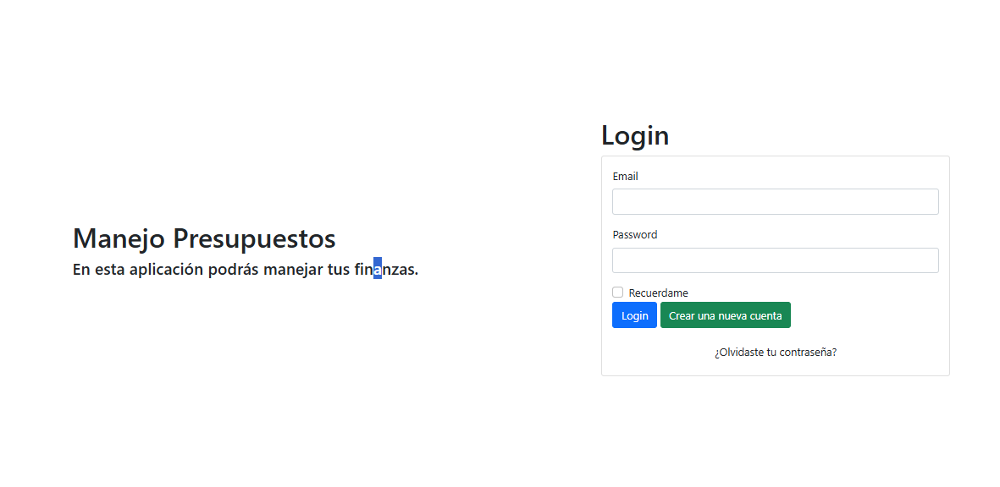
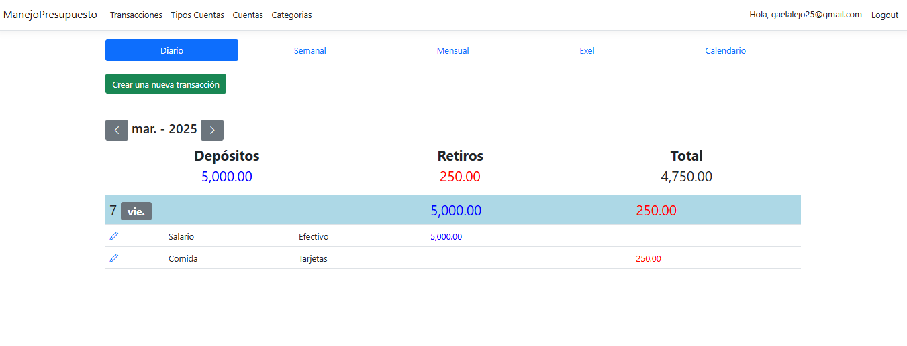
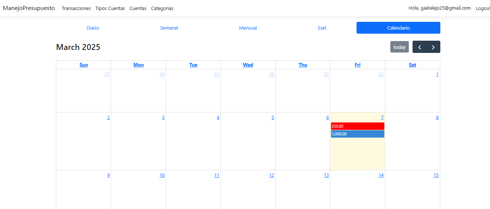
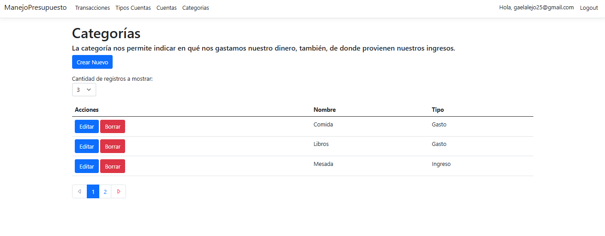
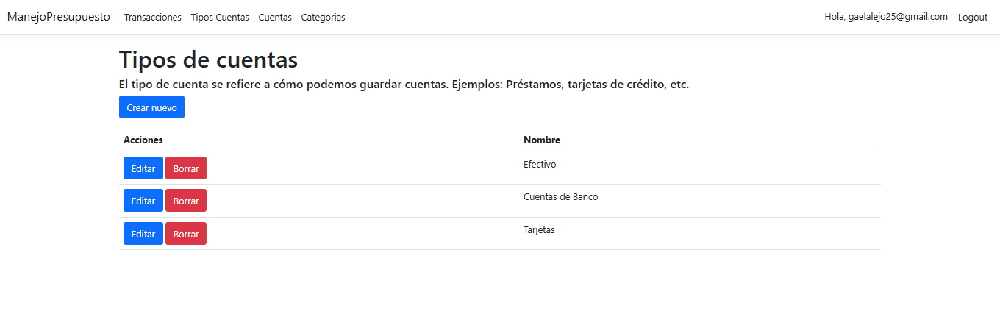

# Manejo de presupuesto Web App

Manejo de presupuesto es una aplicacion web para administrar y gestionar los diferentes tipos de gasto que puede tener una usuario en su dia a dia. Cuenta con autenticacion y control de usuarios. Se pueden configurar diferentes tipos de transacciones como por ejemplo si gasto dinero en comida, ropa, tarjetas, etc. Asi como incluir ingresos de su salario, prestamos, etc. Todo esto lo puede configurar el usuario con forme lo necesite. Las principales tecnologias que se usaron fueron ASP.NET Core, SQL Server, Dapper, JS, HTML, Bootstrao y CSS.  

## Screenshots

## Tech Stack

**Frontend:** Bootstrap, HTML, JS y CSS
**Backend:** C#, SQL Server y Dapper

